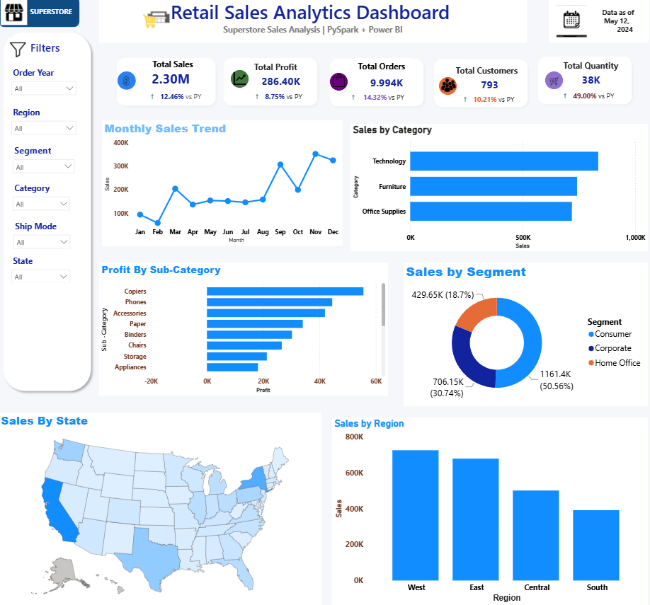

# 📊 Retail Sales Analytics Dashboard

A professional interactive Power BI dashboard built using the Superstore dataset to analyze sales performance, profitability, customer segments, product categories, and regional trends. This dashboard enables business users to identify key insights and make data-driven decisions.

---

## 🚀 Project Overview

This project provides an end-to-end retail sales analysis using Power BI. It highlights important business metrics through interactive visualizations, KPI cards, charts, and geographical analysis.

---

## 🎯 Business Problem

Retail businesses generate large volumes of sales data. Without effective analysis, it becomes difficult to identify profitable product categories, customer segments, seasonal trends, and regional performance.

This dashboard helps answer questions such as:
- Which category generates the highest sales?
- Which sub-category earns the highest profit?
- Which customer segment contributes the most revenue?
- Which region performs the best?
- How do sales change month by month?

---

## 🛠️ Tools & Technologies

- Microsoft Power BI
- Power Query
- DAX
- Superstore Dataset
- Data Visualization
- PySpark
  
---

## 📊 Dashboard Features

- KPI Cards
  - Total Sales
  - Total Profit
  - Total Orders
  - Total Customers
  - Total Quantity

- Monthly Sales Trend

- Sales by Category

- Profit by Sub-Category

- Sales by Segment

- Sales by State (Map)

- Sales by Region

- Interactive Filters
  - Order Year
  - Region
  - Segment
  - Category
  - Ship Mode
  - State

---

## 📈 Key Business Insights

- Technology is the highest revenue-generating category.
- Consumer segment contributes the largest share of sales.
- West region records the highest sales.
- Sales peak during November and September.
- Copiers generate the highest profit among all sub-categories.

---

## 📷 Dashboard Preview

### Dashboard Overview



---

## 📂 Repository Structure

```
Retail-Sales-Analytics-Dashboard/
│── Retail Sales Analytics.pbix
│── Superstore.csv
│── Dashboard.png
│── README.md
```

---

## ▶️ How to Use

1. Clone this repository.
2. Open the `.pbix` file using Microsoft Power BI Desktop.
3. Explore the dashboard using filters and slicers.
4. Interact with charts to perform detailed analysis.

---

## 📌 Skills Demonstrated

- Data Cleaning
- Data Modeling
- DAX Calculations
- Power Query
- KPI Design
- Dashboard Design
- Business Intelligence
- Data Visualization
- Interactive Reporting

---

## 👤 Author

**Appani Tejaswi**

- LinkedIn: https://www.linkedin.com/in/tejaswi-appani-a2b087369
- GitHub: https://github.com/AppaniTejaswi

---

⭐ If you found this project useful, consider giving it a star!
